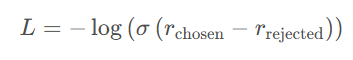
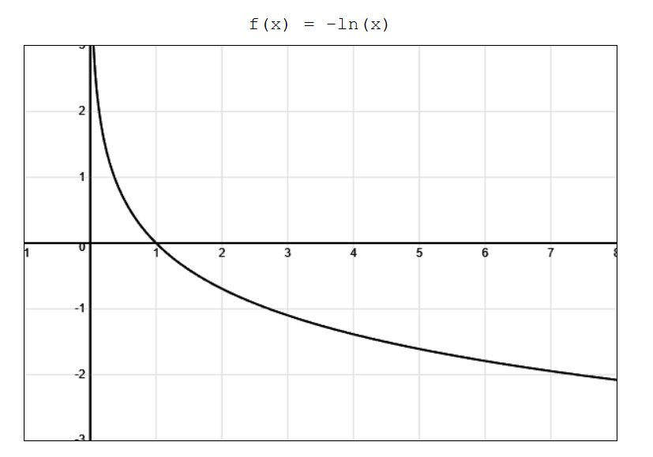
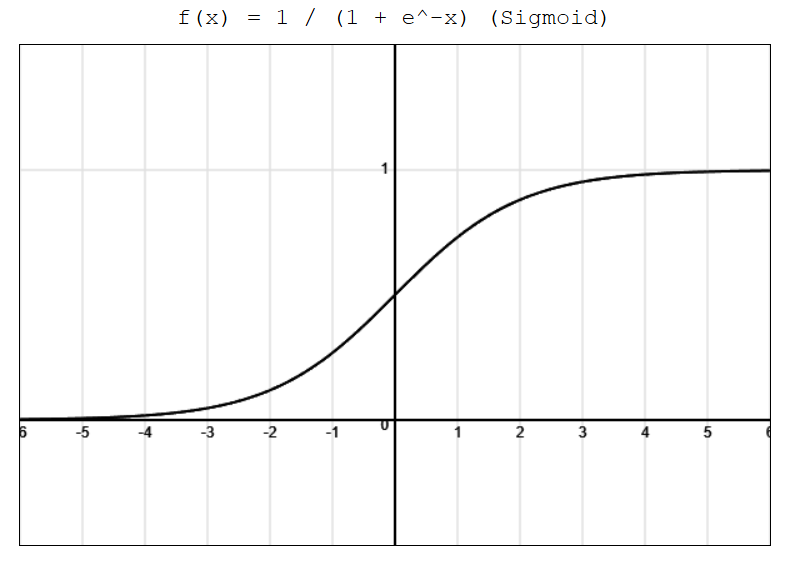
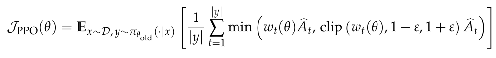
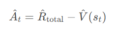
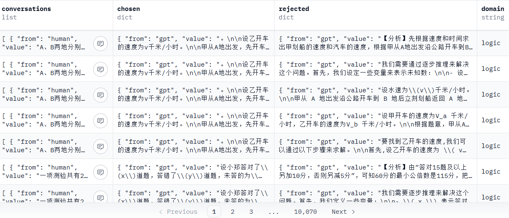
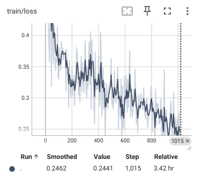
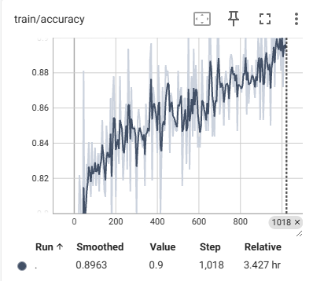
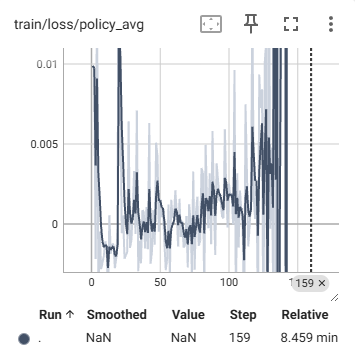
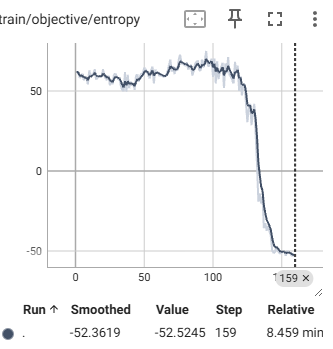

# ppo_reproduce PPO算法复现

本项目基于 Qwen2.5-0.5B 语言模型全流程复现PPO算法，reward模型训练+policy模型训练。

## 🎯 项目概述

本项目围绕 Qwen2.5-0.5B 复现 PPO 全流程：使用 COIG-P 偏好数据集并将其映射为 TRL 兼容格式，先在 `reward_train.ipynb` 中为模型加线性头完成偏好建模，再用 TRL 提供的 PPO 实现通过 `ppo_train.py`（或 accelerate 方式）对策略/价值模型联合优化（含 KL 惩罚的优势估计），依赖以 `uv sync` 管理，可按需在单机或多卡环境运行。

## 🔍 算法原理
### reward模型训练
模型结构复用qwen2.5-0.5B，在输出层拼一个线性映射层，让模型输出一个关于人类偏好标量值。

损失函数用成对偏好函数，通过[Bradley-Terry](https://blog.csdn.net/shizheng_Li/article/details/144629002)模型建模人类偏好，如果**chosen**比**rejected**得分高则损失变小，让模型给人类偏好的回答数据打高分。
<p align="center">
    
</p>
-log为-ln函数，σ表示sigmoid函数，r表示模型对数据的打分。

对着图像来解释，r(chosen) - r(rejected)越大，sigmoid函数越接近于1，-ln函数越接近于0，即loss函数越小
<p align="center">
    
    
</p>

### policy模型训练
PPO算法是一种actor-critic方法，需要同时训练actor模型和critic模型。actor模型为qwen2.5-0.5B，critic模型复用reward模型（本质上都是输出一个标量打分）。

PPO算法目标函数为：
<p align="center">
    
</p>
其中π就是需要训练的策略模型，即actor模型。

优势函数为：
<p align="center">
    
</p>
其中R是用reward模型+KL惩罚项计算的总回报估计，V是value网络对当前状态的价值估计，即critic模型。

## 📚 数据集
数据集选用M-A-P团队的COIG-P，是一个百万级中文人工智能偏好训练数据集，数据列如下所示
<p align="center">
    
</p>
（本项目用trl包训练的reward模型和ppo算法，因此在使用上述数据集时需要把数据映射为trl的数据格式）

## 📊 效果展示

### 运行环境
- **reward模型训练**: 4小时（1 × AutoDL vGPU-32GB）
- **policy模型训练**: 20分钟（2 × AutoDL 5090-32GB）

（目前训练的learning rate为1e-4，从训练过程来看极度不稳定，作者因为看到loss收敛就不深究稳定性问题了，lr可以调小一点让训练过程稳定一点）

### 训练效果
#### reward模型训练
在单GPU下训练4小时左右，loss逐渐收敛且人类偏好的分类准确率上升到0.9左右，已经够用就直接停了。
<p align="center">
    
    
</p>
<p align="center">
    <em>Figure 1: reward 训练过程中的 loss 和 accuracy 曲线</em>
</p>

#### policy模型训练
在2×5090下训练20min左右，训练前期loss甚至逐步上升，150个step左右loss和策略熵骤降。

前期策略比较接近参考模型 / 初始化模型 ⇒ 熵高、输出多样；训练一段时间后，策略发现一套 在 reward 模型下得分很高但相对单一的输出模式；一旦开始朝这个“高 reward 峰值”收敛，优势函数在这些动作上大多为正，更新的方向非常一致：
policy 很快就会把这些 token 的概率拉得很高；其它动作概率迅速被压到很低；熵就会从“还在探索”快速掉到“接近确定性”。
<p align="center">
    
    
    
</p>
<p align="center">
    <em>Figure 1: PPO 训练过程中的 loss 和 entropy 曲线</em>
</p>

## 🚀 项目部署运行

### 模型和数据集下载

```bash
# 模型或数据有网络问题可以在modelscope或者hf镜像站下载

# 下载Qwen2.5-0.5B模型
git clone https://huggingface.co/Qwen/Qwen2.5-0.5B

# 偏好数据
git clone https://huggingface.co/datasets/m-a-p/COIG-P
```

### 依赖安装

```bash
pip install uv
uv sync
```

### 训练步骤

```bash
# train reward model
reward_train.ipynb

# train policy model
python ppo-train.py
accelerate launch train.py # 兼容accelerate分布式训练
```

## 🛠️ 踩坑记录

- PPO算法很占资源，在训练时要同时起policy model、ref model、value model、reward model。此外policy model和value model需要同时训练，对于qwen2.5-0.5b这个小模型，2×32GB显存都比较紧张。难怪deepseek grpo算法干掉了value model。
- PPO算法很容易训崩，学习率偏大可能就导致NaN/Inf，训练的参数难调。最终作者没调出一个能稳定训练的状态，但还好能观察到loss和entropy收敛的情况，不然要怀疑程序设计问题了。
- load_datasets函数会自动创建数据副本，在AutoDL这种租的服务器上稍微跑了几次数据集就把磁盘占满了，需要手动删除。
- jupyter文件没法用accelerate加速训练，本来是想调试方便用jupyter写个训练项目试试水，但没法用多卡，不建议训LLM用jupyter脚本训练。
- AutoDL的vGPU不支持nccl，再次踩了这个坑，用accelerate起脚本时报底层通信的错误，第一反应就是通信的问题，但是找了半个小时没找到accelerate在哪里配置nccl/gloo，最后直接租了2×5090解决。


## 📖 参考资料

1. [hf-trl](https://hugging-face.cn/docs/trl/index)提供了dpo/ppo/grpo等主流方法的训练工具，极大地简化了训练开发，rollout、loss函数等细节无需重复造轮子。

## 🤝 贡献与交流

欢迎提交Issue和Pull Request来改进项目。这是一个探索性的学习项目，旨在分享多模态模型训练和部署的经验。

## 📄 许可证

本项目采用开源许可证，详见LICENSE文件。

---

**注意**: 这是一个以探索和学习为目标的项目，代码实现可能存在不足之处。如果您发现任何问题，欢迎提出Issue或PR。感谢您的指正和交流！
